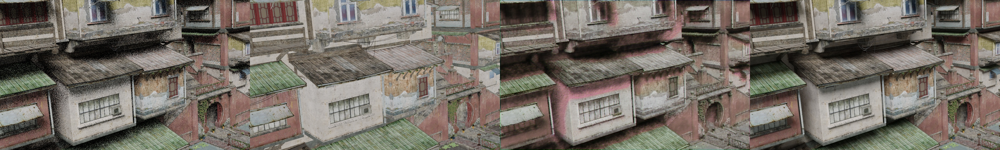

# Siggraph17论文复现

原文：https://research.nvidia.com/publication/interactive-reconstruction-monte-carlo-image-sequences-using-recurrent-denoising
FlowNet2：https://github.com/NVIDIA/flownet2-pytorch
PVDNet：https://github.com/codeslake/PVDNet
ESTRNN：https://github.com/zzh-tech/ESTRNN

## 文件夹

- code：原始代码备份
- code-aug：增强学习代码
- code-flow：光流代码
- code-loss：修改损失函数后代码
- code-mid：加入中值滤波并调整sequence权重代码
- code-raw：原始代码
- code-rnn：测试RNN有效性代码
- code-sequence：测试sequence有效性代码
- code-testrnn：调节RNN和sequence代码
- only-noise：单通道训练代码


## 运行命令

- 运行环境

```
python3.7 pytorch
```

- 训练代码

  其中：data_dir为数据集地址，save_dir为模型保存地址，epochs为训练epoch数量，sequence为所设sequence大小，load为载入预训练模型地址。

```
python ./train.py --data_dir /Disk5/xudong/CG/Building2-Out --save_dir /Disk5/xudong/CG/models --epochs 200 --sequence 3 --load /Disk5/xudong/CG/models/None_120.pt
```

- 测试代码

  其中：data_dir为数据集地址，output_dir为输出图片保存地址，sequence为所设sequence大小，checkpoint为载入预训练模型地址。

```
python ./test.py --data_dir /Disk5/xudong/CG/Building1-Out --output_dir /Disk5/xudong/CG/code-sequence/OUT --checkpoint /Disk5/xudong/CG/models/None_120.pt --sequence 3
```


## 输出图片

共分为四小张，第一张为带噪点图片，第二张为albedo通道，第三张为模型输出图片，第四张为对照图片。





## 数据集

* 地址

  ```
  链接：https://pan.baidu.com/s/1PYR-kGSehYvWiZlP-XbSrg 
  提取码：sjtu 
  --来自百度网盘超级会员V5的分享
  ```

* 格式

  ```
  albedo    -- 反射率
  depth     -- 深度
  GlossDir  -- 直接光泽
  GlossInd  -- 简介光泽
  intensity -- 强度
  normal    -- 法线
  out       -- 有噪声（1spp）的图片
  reference -- 参考图片
  shadowing -- 阴影
  以上大小均为1920x1200
  ```

* 几个数据集的介绍

  * building1，共120张图片，镜头移动速度先快后慢

    

  * building2，共120张图片，镜头移动速度很快

    

  * building3，共135张图片，镜头移动速度中等

    

  * building4，共700张图片，镜头移动速度慢

    

  * basketball，渲染了两个数据集，一个镜头不运动（140张），一个运动非常缓慢（140张）

    

  * bed，共140张图片

    

  
