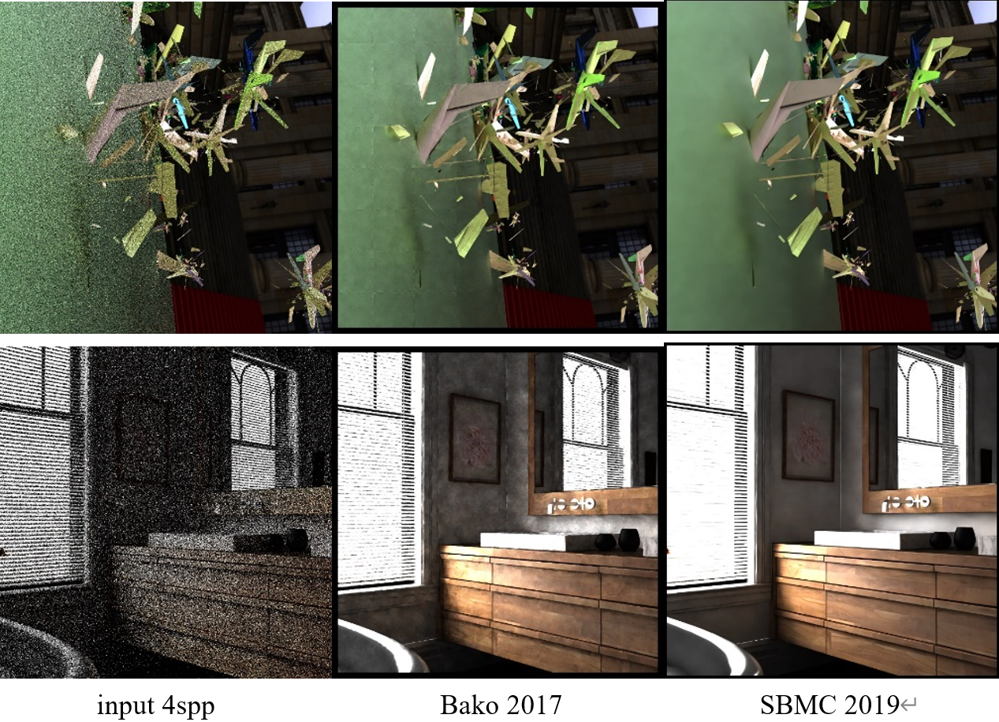

# siggraph 19 SMBC复现指南

项目主页地址：[http://groups.csail.mit.edu/graphics/rendernet/](http://groups.csail.mit.edu/graphics/rendernet/)

论文pdf下载：[paper](http://groups.csail.mit.edu/graphics/rendernet/data/mc_denoising.pdf)

论文slides下载：[slides](http://groups.csail.mit.edu/graphics/rendernet/data/slides.pdf)

论文github：[github](https://github.com/adobe/sbmc)



## 准备工作

1. NVIDIA 20系列显卡
2. nvidia docker


## 复现方案1（推荐）

```shell
git clone https://github.com/adobe/sbmc.git
cd sbmc
make nvidia_docker
# 此时，打开 sbmc/dockerfile/cuda-sbmc.dockerfile
# 找到其中三处"github.com"，改成github的国内镜像"hub.fastgit.org"
make docker_build
# 然后经过很长时间以后会有报错，说scipy只适合python>=3.8，不用管它
# 找到刚刚安装一般的docker的container，attach他
docker ps --all
docker attach ${你刚刚创建一半的container的id}
pip install scipy
pip install torch-tools
# 添加cuda库的位置
echo "LD_LIBRARY_PATH=$LD_LIBRARY_PATH:/usr/local/cuda/compat/" >> ~/.bashrc
source ~/.bashrc

# 安装halide_pytorch
cd /sbmc_app/sbmc
cd halide_pytorch

# 安装剩余东西
python setup.py install
cd ..
python setup.py install
```


## 复现方案2

本组的docker镜像已经打包为tar文件存储到百度云，点击以下链接下载镜像创建容器即可。

```shell
链接：https://pan.baidu.com/s/1IULI5V3lXHQ5MBRcvYlHkQ 
提取码：sjtu 
--来自百度网盘超级会员V5的分享
```
